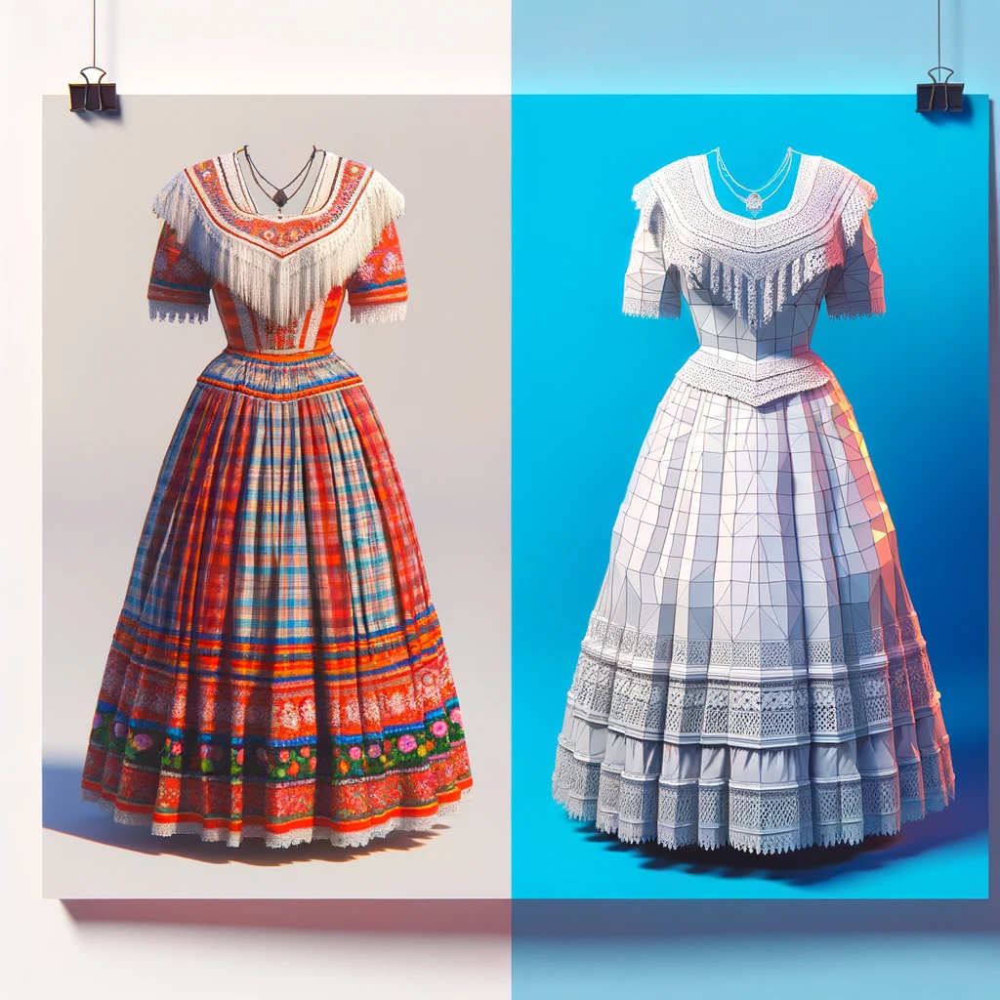

# Taller de Fotogrametría Proyecto "La Moda es Luz"

### Agenda del Taller de Fotogrametría con Polycam

#### **Duración: 3 horas**

**1. Introducción y Bienvenida (15 minutos)**
   - Presentación del facilitador y objetivos del taller.
   - Breve explicación sobre qué es la fotogrametría y su importancia en la preservación y documentación de trajes y textiles.

**2. Conceptos Básicos de Fotogrametría (20 minutos)**
   - Definición y principios fundamentales de la fotogrametría.
   - Aplicaciones de la fotogrametría en museos y patrimonio cultural.

**3. Introducción a Polycam (20 minutos)**
   - Descripción general del software Polycam.
   - Ejemplos de proyectos realizados con Polycam.

**4. Configuración y Preparación para la Captura (30 minutos)**
   - Preparación del entorno y del objeto a capturar.
   - Ajustes y configuraciones de la cámara y del software.

**5. Práctica de Captura de Imágenes (40 minutos)**
   - Captura de imágenes de una pieza de la colección en exhibición o alguna de las prendas de los participantes.
   - Supervisión y asistencia durante la práctica.
   - Resolución de dudas y problemas comunes.

**6. Procesamiento de Imágenes en Polycam (30 minutos)**
   - Carga de imágenes en Polycam.
   - Proceso de generación del modelo 3D.

**7. Cierre y Evaluación (10 minutos)**
   - Resumen de los puntos clave del taller.
   - Evaluación y retroalimentación de los participantes.
   - Agradecimientos y despedida.

#### **Materiales Necesarios:**
- Dispositivo móvil o tablet con Polycam instalado.
- Objeto (pieza de la colección en exhibición o prenda de los participantes) para la práctica de fotogrametría.
- Conexión a internet.
- Proyector y pantalla para presentaciones.

#### **Notas Adicionales:**
- El Museo de Trajes dispondrá de varios smartphones con el software Polycam y las licencias requeridas para el taller.
- Proveer ejemplos visuales y guías impresas o digitales para apoyo.
- Facilitar un canal de comunicación para consultas posteriores al taller.
